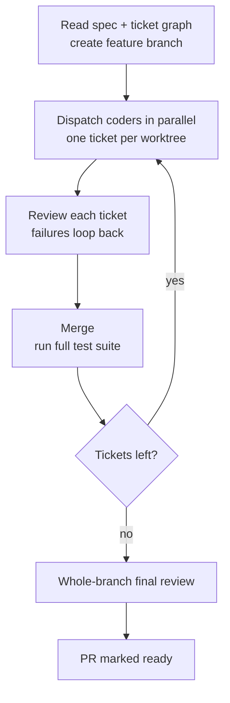

# pi-matt-implement-flow

**pi-matt-implement-flow** is a package for [pi](https://github.com/earendil-works/pi): one skill (`/pi-matt-implement-flow`) plus three agents — `coder`, `reviewer`, and `final-reviewer`.

It covers the part of Matt Pocock's [`/implement`](https://github.com/mattpocock/skills) that stops scaling when the work is **many tickets with dependencies between them**: a single session moving one ticket at a time, you watching for what has unlocked, and no quality gate per ticket.

The upstream flow stays as-is: `/grill-with-docs` → `/to-spec` → `/to-tickets`. This package takes over the last step — implementing the ticket graph, getting implementation, review, and testing done in one command.

English | [简体中文](./README.zh-CN.md)

## Capabilities

1. **Parallel by dependency, no context to fight over** — each ticket gets its own throwaway worktree and a fresh context; independent tickets run in parallel, blocked ones start automatically once their prerequisites close.
2. **Throwaway workspaces managed for you** — temp worktrees and branches are created when needed and reclaimed when a ticket ends; nothing to maintain by hand.
3. **Reviewed as soon as it is written, fixed until it passes** — each ticket gets a two-axis review (repo standards + against the spec) right after coding; failures go back for fixes, then it is reviewed again.
4. **Coding and review are separate roles, configured separately** — coder and reviewer are independent agents; each role can have its own model and thinking level.
5. **The full suite runs on every merge** — each ticket merged into the feature branch immediately triggers the project's full test suite, so integration problems surface on the ticket that caused them instead of piling up at the end.
6. **A whole-branch final review** — after the last ticket merges, the entire feature branch is reviewed once more for what single-ticket reviews cannot see: cross-file drift, components contradicting each other, spec requirements no ticket implemented, docs that no longer match the code.
7. **Interrupted runs resume** — a run's progress is recorded in a local run directory inside your repo; after an interruption or context compaction it continues from the recorded state, not from memory.
8. **Stuck tickets never block the rest** — a ticket that exhausts its fix budget is handed to you when the run ends; everything else keeps moving. With a GitHub remote, the run opens a draft PR at the start and marks it ready for review at the end.

## Requirements

- [pi](https://github.com/earendil-works/pi) coding agent with the [pi-subagents](https://github.com/nicobailon/pi-subagents) package (parallel dispatch, managed worktrees, resume)
- Matt Pocock's [engineering skills](https://github.com/mattpocock/skills/tree/main/skills/engineering) — the upstream commands (`/grill-with-docs` → `/to-spec` → `/to-tickets`) and the skills the agents work with: `tdd`, `codebase-design`, `code-review`, `resolving-merge-conflicts`

This package does not replace the upstream flow — it only takes over the implementation stage.

## Install

Install into pi from npm:

```sh
pi install npm:pi-matt-implement-flow
```

Optionally, run the self-check suite:

```sh
npm test
```

## Quick start

1. **One-time setup** — install pi, pi-subagents, and Matt Pocock's engineering skills, then run `/setup-matt-pocock-skills` once in your repo.
2. **Prepare the work**:

   ```
   /grill-with-docs
   /to-spec
   /to-tickets
   ```

   Before starting, check three things: a clean worktree, at least one commit, and a full-suite test command that runs.

3. **Run**:

   ```
   /pi-matt-implement-flow [N]
   ```

   `N` is the number of parallel coders; the command-line value overrides the configured default (see [Configuration](#configuration)). Most tickets finish on their own; anything that cannot be auto-fixed or needs your call is collected and reported when the run ends.

## How it works

### The roles

A run has four roles. The last three take a model and thinking level (see [Configuration](#configuration)):

| Role | Does | Doesn't |
| --- | --- | --- |
| **Main agent** (the skill running in your current session) | Reads the spec and ticket graph, dispatches by dependency, merges, runs the full suite, decides what comes next | Never writes feature code |
| **coder** | Implements one ticket in its own worktree — a test-first vertical slice — commits everything, reports verifiable results | Never touches ticket status, merges, or pushes |
| **reviewer** | Read-only review of that one ticket: repo standards + the spec / ticket requirements | No code changes, no test runs (the flow's test gate already covered that) |
| **final-reviewer** | After everything merges, reviews the whole feature branch — including what only cross-ticket eyes can see | Also read-only, no code changes |

### The flow

1. Read the spec and the ticket dependency graph; create (or reuse) the feature branch.
2. Pick the tickets with no unfinished prerequisites and dispatch coders up to the concurrency cap — one ticket per coder, one worktree per ticket.
3. When a coder finishes: the ticket's gate tests run → (if per-ticket review is on) the reviewer does a two-axis review → failures go back to the same coder, until it passes or hits the fix cap.
4. Merge into the feature branch and immediately run the full suite; if it is red, fix the integration problem on the feature branch.
5. Recompute the next batch of doable tickets and repeat 2–4 until everything is done or handed to you.
6. The final-reviewer reviews the whole branch; with a GitHub remote, the draft PR is marked ready.



Tickets that exhaust their fix budget land on a hand-off list for you at the end — they do not hold up the rest.

## Configuration

### Changing settings

The built-in interactive wizard (no LLM in the loop):

```
/matt-flow-config        # pick a role → pick model / thinking level, or edit flow options
/matt-flow-config show   # show the effective flow options and each role's actual model / thinking level
```

You can also edit pi's `settings.json` directly. Settings have two layers; the project layer overrides the user layer field by field:

- user: `~/.pi/agent/settings.json`
- project: `<repo>/.pi/settings.json`

When changes take effect:

- Model / thinking level: the next time that role is dispatched — no pi restart needed.
- Flow options: from the next `/pi-matt-implement-flow`; a run already in progress is never affected.

### Flow options (`mattImplementFlow`)

| Option | Default | What it does |
| --- | --- | --- |
| `reviewer` | on | Runs a two-axis review per ticket before merge, with a fix loop. Off: each ticket keeps only the test gate; the whole-branch final review still runs. Parallelism and per-ticket review both cost extra model calls — to spend less, turn this off first or lower `maxConcurrent`. |
| `maxFixRounds` | `2` | Auto-fix attempts per ticket before it is handed to you. Only meaningful when review is on. |
| `maxConcurrent` | `3` | Coders working at the same time. The number in `/pi-matt-implement-flow 5` overrides this. |

```jsonc
{
  "mattImplementFlow": {
    "reviewer": true,
    "maxFixRounds": 2,
    "maxConcurrent": 3
  }
}
```

### Model & thinking per role

Three configurable roles: `coder`, `reviewer`, `final-reviewer` (the main agent is your current session — not configured here). Per role:

- **Model**: the model that role actually calls; unset means it follows the session / pi default subagent model.
- **Thinking level**: `off` / `minimal` / `low` / `medium` / `high` / `xhigh` / `max`. The package ships with high levels; lower them for cost or easier tasks.

A typical split: a strong model for `coder`; reviewers on a cheaper (or different) review-oriented model; keep `final-reviewer` thinking high. All of it is set through `/matt-flow-config`.

### How the command line interacts

1. `N` in `/pi-matt-implement-flow [N]` overrides concurrency only — not the review switch or the fix cap.
2. Project settings override user settings field by field, not as a whole block.
3. Flow options are read and frozen at run start; changing settings mid-run never affects the running one.

## Run directory

Every run writes a local run directory, `.pi/matt-implement/<feature>/`:

```text
.pi/matt-implement/<feature>/
  ledger.md          # human-readable progress for this run: active / done, per-ticket status, timeline
  events.jsonl       # machine-run record; an interrupted run resumes from it
  notes.md           # process notes and decisions worth remembering (for you)
  reviews/           # diffs used by each review round
  findings/          # review findings, plus post-merge full-suite failures
```

- The path is gitignored and never enters version control. This is run data, not a cache — do not delete it while a run is active or might be resumed.
- `ledger.md` and `events.jsonl` are maintained by the flow; do not hand-edit them. Notes belong in `notes.md`.
- After the run, once only the branch / PR matters, keep the directory as a record or clean it up — your call.

## Audit report

Audit a finished run after the fact: [`audit-report/`](./audit-report/README.md) turns the run directory into a browsable static report site — zero LLM calls, the main flow untouched.

## License

[MIT](./LICENSE)
