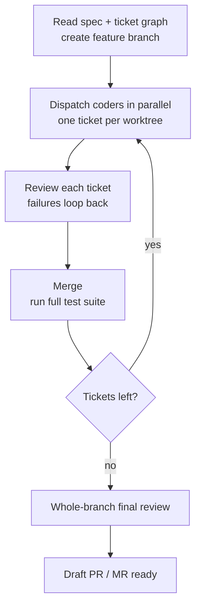

# pi-matt-implement-flow

**pi-matt-implement-flow** is a package for [pi](https://github.com/earendil-works/pi): one skill (`/pi-matt-implement-flow`) plus three agents — `coder`, `reviewer`, and `final-reviewer`.

It covers the part of Matt Pocock's [`/implement`](https://github.com/mattpocock/skills) that stops scaling when the work is **many tickets with dependencies between them**: a single session moving one ticket at a time, you watching for what has unlocked, and no quality gate per ticket.

The upstream flow stays as-is: `/grill-with-docs` → `/to-spec` → `/to-tickets`. This package takes over the last step — implementing the ticket graph, getting implementation, review, and testing done in one command.

English | [简体中文](./README.zh-CN.md)

## Capabilities

1. **Parallel by dependency, no context to fight over** — each ticket gets its own throwaway worktree and a fresh context; independent tickets run in parallel, blocked ones start automatically once their prerequisites close.
2. **Throwaway workspaces managed for you** — temp worktrees and branches are created when needed and reclaimed when a ticket ends; nothing to maintain by hand.
3. **Reviewed as soon as it is written, fixed until it passes** — each ticket gets a two-axis review right after coding — the repo's coding standards and the spec — and failures go back for fixes while there is a reasonable next step within the approved scope.
4. **Coding and review are separate roles, configured separately** — coder and reviewer are independent agents; each role can have its own model and thinking level.
5. **The full suite runs on every merge** — each ticket merged into the feature branch immediately triggers the project's full test suite, so integration problems surface on the ticket that caused them instead of piling up at the end.
6. **A whole-branch final review** — after the last ticket merges, the entire feature branch is reviewed once more for what single-ticket reviews cannot see: cross-file drift, components contradicting each other, spec requirements no ticket implemented, docs that no longer match the code.
7. **Interrupted runs resume** — a run's progress is recorded in a local run directory inside your repo; after an interruption or context compaction it continues from the recorded state, not from memory.
8. **Repairs without a retry quota** — ticket repairs do not stop just because an attempt count was reached. When a requirement decision, permission, external condition, or evidence-backed next step is missing, the run pauses and explains what it needs from you. With GitHub or GitLab the run opens a draft PR or MR at the start; with local markdown the feature branch itself is the deliverable.
9. **Three trackers, first-class** — local markdown, GitHub Issues, or GitLab Issues: the run picks up whichever tracker `/setup-matt-pocock-skills` set up in your repo. With GitHub or GitLab your tickets are updated automatically at the end — merged tickets closed and linked to their commits, escalations commented and left open — two sessions can never silently start the same feature, and renamed labels are still recognized.

## Requirements

- [pi](https://github.com/earendil-works/pi) coding agent with the [pi-subagents](https://github.com/nicobailon/pi-subagents) package (parallel dispatch, managed worktrees, resume)
- Matt Pocock's [engineering skills](https://github.com/mattpocock/skills/tree/main/skills/engineering) — the upstream commands (`/grill-with-docs` → `/to-spec` → `/to-tickets`) and the skills the agents work with: `tdd`, `codebase-design`, `code-review`, `resolving-merge-conflicts`

This package does not replace the upstream flow — it only takes over the implementation stage.

- Remote trackers also need the host CLI for that tracker: `gh` for GitHub, `glab` for GitLab (installed and signed in to the target host). Local markdown needs no CLI.

Before every run, check three things: a clean worktree, at least one commit in the repo, and a full-suite test command that runs.

## Tracker support

Where your tickets live is not a flag — it comes from the two setup files `/setup-matt-pocock-skills` wrote into your repo: `docs/agents/issue-tracker.md` plus the `triage-labels.md` beside it. The run identifies your tracker from them automatically (edited wording in the files is fine).

| Tracker | Status | PR / MR | Notes |
| --- | --- | --- | --- |
| Local markdown (`.scratch/<feature>/`) | first-class | none | your ticket files stay the single source of truth — nothing is synced either way |
| GitHub Issues | first-class | PR | your issues are updated automatically at the end (merged tickets closed with their commit linked); ticket dependencies expressed via sub-issues |
| GitLab Issues | first-class | MR | your issues are updated automatically at the end (a note is posted before a ticket closes); ticket dependencies without sub-issues; self-hosted GitLab works too |
| Anything else | explicitly unsupported | — | not guessed, not degraded — the run stops with a clear error, see below |

When the setup is missing or does not look like one of the three, the run stops with a clear error instead of guessing: **setup files missing** → run `/setup-matt-pocock-skills` in your repo; **tracker not recognized** → the run refuses with `仅支持 local / github / gitlab 三种` (only these three are supported).

## Install

Install into pi from npm:

```sh
pi install npm:pi-matt-implement-flow
```

Optionally, run the self-check suite:

```sh
npm test
```

## Quick start

1. **One-time setup** — install pi, pi-subagents, and Matt Pocock's engineering skills, then run `/setup-matt-pocock-skills` once in your repo.
2. **Prepare the work**:

   ```
   /grill-with-docs
   /to-spec
   /to-tickets
   ```

3. **Run**:

   ```
   /pi-matt-implement-flow [N]
   ```

   `N` is the number of parallel coders; the command-line value overrides the configured default (see [Configuration](#configuration)). Most tickets finish on their own; when progress needs your decision or help, the run explains the blocker and pauses rather than waiting until the end to tell you.

### What you get

When the run finishes, you have:

- a merged **feature branch** — every accepted ticket's changes on it, with the full test suite green;
- with GitHub / GitLab: a **draft PR / MR marked ready for review**, and your tracker tickets updated (see [Tracker support](#tracker-support));
- a **run directory** `.pi/matt-implement/<feature>/` (see [Run directory](#run-directory)): a human-readable progress ledger (`ledger.md`), notes (`notes.md`), and the record of any tickets handed to you (also in the end-of-run summary);
- optionally, a browsable [audit report](#audit-report) of the whole run.

## How it works

### The roles

A run has four roles. The last three take a model and thinking level (see [Configuration](#configuration)):

| Role | Does | Doesn't |
| --- | --- | --- |
| **Main agent** (the skill running in your current session) | Reads the spec and ticket graph, dispatches by dependency, merges, runs the full suite, decides what comes next | Never writes feature code |
| **coder** | Implements one ticket in its own worktree (tests first, then the implementation), commits everything, reports verifiable results | Never touches ticket status, merges, or pushes |
| **reviewer** | Read-only review of that one ticket: repo standards + the spec / ticket requirements | No code changes, no test runs (tests already ran at the gate) |
| **final-reviewer** | After everything merges, reviews the whole feature branch — including what only cross-ticket eyes can see | Also read-only, no code changes |

### The flow

1. Read the spec and the ticket dependency graph; create (or reuse) the feature branch.
2. Pick the tickets with no unfinished prerequisites and dispatch coders up to the concurrency cap — one ticket per coder, one worktree per ticket.
3. When a coder finishes: the ticket's gate tests run → (if per-ticket review is on) the reviewer does a two-axis review → failures go back to the same coder while there is a reasonable next step within the approved scope.
4. Merge into the feature branch and immediately run the full suite; if it is red, fix the integration problem on the feature branch.
5. Recompute the next batch of doable tickets and repeat 2–4 until everything is done or handed to you.
6. The final-reviewer reviews the whole branch; with GitHub or GitLab, the draft PR / MR opened at the start is marked ready for review.


```mermaid
flowchart TD
    A["Read spec + ticket graph<br>create feature branch"] --> B["Dispatch coders in parallel<br>one ticket per worktree"]
    B --> C["Review each ticket<br>failures loop back"]
    C --> D["Merge<br>run full test suite"]
    D --> E{"Tickets left?"}
    E -- yes --> B
    E -- no --> F["Whole-branch final review"]
    F --> G["Draft PR / MR ready"]
```

Ticket repair has no attempt quota. A clarification or withdrawal of one review finding is not approval to merge: the necessary full review and validation must still cover the current code. More than one repair can happen between reviews, and a fresh full review can happen without another code change.

## Configuration

### Changing settings

The built-in interactive wizard — instant, no model calls:

```
/matt-flow-config        # pick a role → pick model / thinking level, or edit flow options
/matt-flow-config show   # show the effective flow options and each role's actual model / thinking level
```

You can also edit pi's `settings.json` directly. Settings have two layers; the project layer overrides the user layer field by field:

- user: `~/.pi/agent/settings.json`
- project: `<repo>/.pi/settings.json`

When changes take effect:

- Model / thinking level: the next time that role is dispatched — no pi restart needed.
- Flow options: from the next `/pi-matt-implement-flow`; a run already in progress is never affected.

### Flow options (`mattImplementFlow`)

| Option | Default | What it does |
| --- | --- | --- |
| `reviewer` | on | Runs a two-axis review per ticket before merge, with a fix loop. Off: each ticket keeps only the test gate; the whole-branch final review still runs. Parallelism and per-ticket review both cost extra model calls — to spend less, turn this off first or lower `maxConcurrent`. |
| `maxConcurrent` | `3` | Coders working at the same time. The number in `/pi-matt-implement-flow 5` overrides this. |

```jsonc
{
  "mattImplementFlow": {
    "reviewer": true,
    "maxConcurrent": 3
  }
}
```

Old repair-limit settings are no longer effective, including for older runs that have not been closed. Your saved settings and historical run records are not rewritten. Command timeouts, concurrency limits, and cancellation remain available; having no repair quota does **not** guarantee a finite total runtime or cost.

### Model & thinking per role

Three configurable roles: `coder`, `reviewer`, `final-reviewer` (the main agent is your current session — not configured here). Per role:

- **Model**: the model that role actually calls; unset means it follows the session / pi default subagent model.
- **Thinking level**: `off` / `minimal` / `low` / `medium` / `high` / `xhigh` / `max`. The package ships with high levels; lower them for cost or easier tasks.

A typical split: a strong model for `coder`; reviewers on a cheaper (or different) review-oriented model; keep `final-reviewer` thinking high. All of it is set through `/matt-flow-config`.

### How the command line interacts

1. `N` in `/pi-matt-implement-flow [N]` overrides concurrency only — not the review switch.
2. Project settings override user settings field by field, not as a whole block.
3. Changing settings mid-run never affects a run already in progress.

## Run directory

Every run writes a local run directory, `.pi/matt-implement/<feature>/`:

```text
.pi/matt-implement/<feature>/
  ledger.md          # human-readable progress for this run: active / done, per-ticket status, timeline
  events.jsonl       # machine-run record; an interrupted run resumes from it
  notes.md           # process notes and decisions worth remembering (for you)
  reviews/           # diffs used by each review round
  findings/          # review findings, plus post-merge full-suite failures
  tracker/           # local copy of your remote spec + tickets (GitHub / GitLab runs only)
```

- The path is gitignored and never enters version control. This is run data, not a cache — do not delete it while a run is active or might be resumed.
- `ledger.md` and `events.jsonl` are maintained by the flow; do not hand-edit them. Notes belong in `notes.md`.
- After the run, once only the branch / PR / MR matters, keep the directory as a record or clean it up — your call.

## Audit report

Audit a finished run after the fact: [`audit-report/`](./audit-report/README.md) turns the run directory into a browsable static report site — no LLM calls, and it never changes your run data. It ships with the npm package: `node <install-dir>/audit-report/report.js --runtime-dir <repo>/.pi/matt-implement/<feature>` (with `pi install`, `<install-dir>` is `~/.pi/agent/npm/node_modules/pi-matt-implement-flow`).

## FAQ & troubleshooting

**The run complains about `docs/agents/issue-tracker.md` / tells me to run `/setup-matt-pocock-skills`?**
The one-time setup is missing — run `/setup-matt-pocock-skills` once in your repo.

**It refuses with `仅支持 local / github / gitlab 三种`?**
Your tracker setup file is not one of the three supported templates. Regenerate it with
`/setup-matt-pocock-skills`, or switch to local markdown / GitHub / GitLab.

**Why did the run stop to ask me?**
There is no ticket repair quota to extend. The run asks when it needs a requirement decision,
permission, an external condition, or help finding a justified next step. Read `notes.md` for
the blocker and evidence, and provide the missing input. A pause does not close the run.

**The run was interrupted (or my context was compacted). Do I start over?**
No — run the same command again and it continues from the recorded state (see [Run directory](#run-directory)). Older runs that are still open also use the new repair rules: their old attempt limits no longer apply. Closed runs stay closed.

**What exactly did the run do, and are there hidden problems?**
Generate an [audit report](#audit-report): a browsable, per-ticket account of the whole run, with
an "anomalies & risks" section found by rules.

## Contributing

Contributions are welcome! Before diving in:

- [CONTRIBUTING.md](./CONTRIBUTING.md) — dev workflow (`npm test`, no build step), the issue lifecycle labels, and the PR checklist
- File a [bug report](https://github.com/toomanyopenfiles/pi-matt-implement-flow/issues/new?template=bug.yml) or a [feature request](https://github.com/toomanyopenfiles/pi-matt-implement-flow/issues/new?template=feature.yml) through the issue forms
- Report security vulnerabilities privately via [SECURITY.md](./SECURITY.md) — never as public issues

## License

[MIT](./LICENSE)
