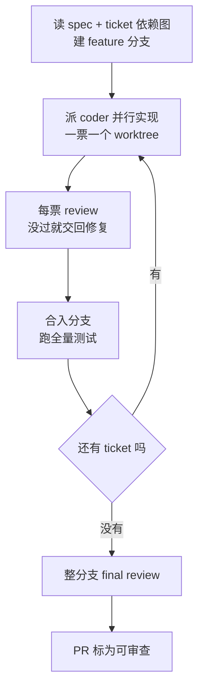

# pi-matt-implement-flow

**pi-matt-implement-flow** 是给 [pi](https://github.com/earendil-works/pi) 用的扩展包：内含一条 skill（`/pi-matt-implement-flow`）和三个配套 agent——`coder`、`reviewer`、`final-reviewer`。

它补强的是 Matt Pocock 的 [`/implement`](https://github.com/mattpocock/skills) 在**多张 ticket、且 ticket 之间有依赖**时不够用的那一段：单会话串行推进、要人盯着哪些票解锁了、没有逐票质量关。

上游照旧：`/grill-with-docs` → `/to-spec` → `/to-tickets`。本包接手最后一步——按 ticket 依赖图实现，把实现、review、测试在一条命令里做完。

[English](./README.md) | 简体中文

## 核心能力

1. **按依赖并行，互不抢上下文**——每张 ticket 用独立的临时 worktree 和干净上下文；没有依赖关系的 ticket 并行推进，有依赖的等前置完成后自动开跑。
2. **临时工作区自动管理**——需要时创建临时 worktree 和临时分支，ticket 结束后自动收回，不用手工维护。
3. **写完即审、有问题就改**——每张 ticket 编码完成后自动做双轴 review（代码规范 + 对照 spec），没过就交回修复，再审再过。
4. **编码与审查分工，模型可分开配**——coder 和 reviewer 是独立 agent，可以给不同角色指定不同的模型和 thinking 档位。
5. **合并即跑全量测试**——每张 ticket 合入 feature 分支后立刻跑项目全量测试，集成问题当场暴露、当场修，而不是堆到最后。
6. **整分支 final review**——全部 ticket 合完后，对整条 feature 分支再审一次，专门看单张 ticket 看不见的问题：跨文件漂移、组件互相矛盾、spec 里有要求却没有 ticket 承接、文档和实现对不上。
7. **中断可续跑**——一次 run 的进度记录在仓库本地的运行目录里；会话中断或上下文被压缩后，从已记录的状态继续，不用凭记忆重来。
8. **修不完不卡全局**——单张 ticket 修复次数用尽后，在 run 结束时交给你处理，其余 ticket 继续走。仓库有 GitHub 远端时，run 开始会开一个 draft PR，全部完成后标为可审查。

## 环境要求

- [pi](https://github.com/earendil-works/pi) coding agent，以及 [pi-subagents](https://github.com/nicobailon/pi-subagents) 包（提供并行派发、托管 worktree 和续跑能力）
- Matt Pocock 的 [engineering skills](https://github.com/mattpocock/skills/tree/main/skills/engineering)——上游三条命令（`/grill-with-docs` → `/to-spec` → `/to-tickets`）和各 agent 依赖的 `tdd`、`codebase-design`、`code-review`、`resolving-merge-conflicts` 都来自这里

本包不替代上游流程，只接手实现阶段。

## 安装

从 npm 安装进 pi：

```sh
pi install npm:pi-matt-implement-flow
```

可选：跑一遍自检，确认安装完好：

```sh
npm test
```

## 快速上手

1. **一次性配置**——装好 pi、pi-subagents 和 Matt Pocock 的 engineering skills，然后在你的仓库里跑一次 `/setup-matt-pocock-skills`。
2. **准备工作**：

   ```
   /grill-with-docs
   /to-spec
   /to-tickets
   ```

   开跑前确认三件事：工作区干净、仓库至少有一个 commit、全量测试命令能跑通。

3. **运行**：

   ```
   /pi-matt-implement-flow [N]
   ```

   `N` 是并行 coder 数量，命令行取值覆盖配置里的默认并发（见[配置](#配置)）。多数 ticket 会自动走完；修不完或需要你拍板的，run 结束时会汇总给你。

## 工作原理

### 角色

一个 run 里共有四种角色。后三个可配模型和 thinking 档位（见[配置](#配置)）：

| 角色 | 做什么 | 不做什么 |
|---|---|---|
| **主 agent**（你当前会话里的这条 skill） | 读 spec 与 ticket 依赖图，按依赖派活、合并、跑全量测试、决定下一张票 | 不写任何功能代码 |
| **coder** | 在一张 ticket 的独立 worktree 里按票实现（测试先行的一条完整切片），提交全部改动并给出可核验的结果 | 不改票状态、不合并、不推远程 |
| **reviewer** | 只读审查这一张 ticket：对照仓库规范 + 对照 spec / 票面要求 | 不改代码、不跑测试（测试已由流程门禁跑过） |
| **final-reviewer** | 全部合入后审查整条 feature 分支；除双轴审查外，还看跨 ticket 才能发现的问题 | 同样只读，不改代码 |

### 流程

1. 读取 spec 与 ticket 依赖图，建（或沿用）feature 分支。
2. 找出当前没有未完成前置依赖的 ticket，按并发上限派 coder，一人一票、一票一个 worktree。
3. coder 完成后：先跑该票的测试门禁 →（若开启逐票 review）reviewer 做双轴 review → 没过就交回同一个 coder 修复，直到通过或达到修复上限。
4. 合入 feature 分支，立刻跑全量测试；测试红了，就在 feature 分支上修集成问题。
5. 重算下一批可做的 ticket，重复 2–4，直到全部完成或交给你处理。
6. final-reviewer 审查整条分支；仓库有 GitHub 远端时，把 draft PR 标为可审查。



修复次数用尽的 ticket 会进入待你处理的清单，不拦住后面的票。

## 配置

### 怎么改

推荐用包内置的交互向导 `/matt-flow-config`（不走模型）：

```
/matt-flow-config        # 选角色 → 选模型 / thinking 档位，或编辑流程选项
/matt-flow-config show   # 查看当前生效的流程选项，以及三个角色实际用的模型与 thinking 档位
```

也可以直接改 pi 的 `settings.json`。配置有两层，项目级按字段覆盖用户级：

- 用户级：`~/.pi/agent/settings.json`
- 项目级：`<仓库>/.pi/settings.json`

改动什么时候生效：

- 改模型 / thinking 档位：下一次派出该角色时生效，不用重启 pi。
- 改流程选项：从下一次 `/pi-matt-implement-flow` 开始生效；正在跑的 run 不受影响。

### 流程选项（`mattImplementFlow`）

| 项 | 默认 | 作用 |
|---|---|---|
| `reviewer` | 开启 | 每张 ticket 合入前做双轴 review 并进入修复。关闭后单票只保留测试门禁，整分支 final review 仍会跑。并行数量和逐票 review 都会明显增加模型调用——想省，先关这项或调低 `maxConcurrent`。 |
| `maxFixRounds` | `2` | 单张 ticket 自动修复的次数上限，用尽则交给你处理。仅在 review 开启时有意义。 |
| `maxConcurrent` | `3` | 同时工作的 coder 数量。命令 `/pi-matt-implement-flow 5` 里的数字优先于这项。 |

```jsonc
{
  "mattImplementFlow": {
    "reviewer": true,
    "maxFixRounds": 2,
    "maxConcurrent": 3
  }
}
```

### 角色的模型与 thinking 档位

可配的角色是三个：`coder`、`reviewer`、`final-reviewer`（主 agent 是你当前会话，不在其列）。每个角色可配：

- **模型**：该角色实际调用的模型；不设则跟随当前会话 / pi 的默认子 agent 模型。
- **thinking 档位**：`off` / `minimal` / `low` / `medium` / `high` / `xhigh` / `max`。包内默认是较高档位，可按成本或任务难度下调。

典型用法：coder 给较强的模型；reviewer 换成更便宜（或另一家）的审查向模型；final-reviewer 保持高 thinking。都在 `/matt-flow-config` 里设置。

### 和命令行的关系

1. `/pi-matt-implement-flow [N]` 的 `N` 只覆盖并发，不影响 review 开关和修复上限。
2. 项目配置覆盖用户配置，是按字段覆盖，不是整段替换。
3. 流程选项在 run 开始时读取并固定，中途改 `settings.json` 不影响正在跑的那次。

## 运行目录

每次 run 都在仓库本地写一个运行目录 `.pi/matt-implement/<功能名>/`：

```text
.pi/matt-implement/<功能名>/
  ledger.md          # 这次 run 的可读进度：进行中 / 已完成、各票状态、时间线
  events.jsonl       # 机器使用的运行记录，中断后靠它续跑
  notes.md           # 过程说明、需要记住的决定（给人看）
  reviews/           # 各轮 review 用的 diff
  findings/          # review 意见，以及合并后全量测试失败时的记录
```

- 路径已写入 `.gitignore`，不会进版本库。这是运行数据，不是缓存——run 进行中或还打算续跑时，不要删。
- `ledger.md` 和 `events.jsonl` 由流程维护，不要手工修改；想留备注写到 `notes.md`。
- 跑完后如果只关心 feature 分支 / PR，目录可以留作记录，也可以自行清理。

## 审计报告

跑完可以做事后审计：[`audit-report/`](./audit-report/README.zh-CN.md) 把运行目录生成为可浏览的静态报告网站——零大模型调用，主流程零改动。

## 许可证

[MIT](./LICENSE)
