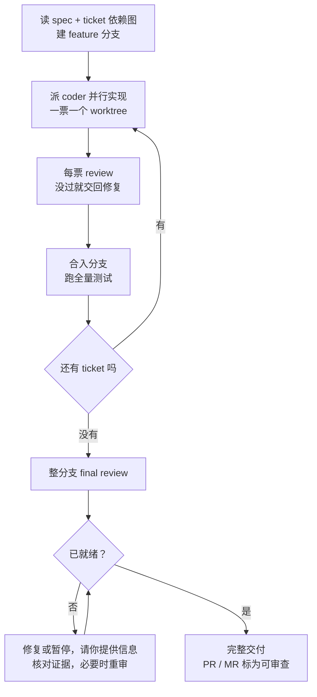

# pi-matt-implement-flow

**pi-matt-implement-flow** 是给 [pi](https://github.com/earendil-works/pi) 用的扩展包：内含一条 skill（`/pi-matt-implement-flow`）和三个配套 agent——`coder`、`reviewer`、`final-reviewer`。

它补强的是 Matt Pocock 的 [`/implement`](https://github.com/mattpocock/skills) 在**多张 ticket、且 ticket 之间有依赖**时不够用的那一段：单会话串行推进、要人盯着哪些票解锁了、没有逐票质量关。

上游照旧：`/grill-with-docs` → `/to-spec` → `/to-tickets`。本包接手最后一步——按 ticket 依赖图实现，把实现、review、测试在一条命令里做完。

[English](./README.md) | 简体中文

## 核心能力

1. **按依赖并行，互不抢上下文**——每张 ticket 用独立的临时 worktree 和干净上下文；没有依赖关系的 ticket 并行推进，有依赖的等前置完成后自动开跑。
2. **临时工作区自动管理**——需要时创建临时 worktree 和临时分支，ticket 结束后自动收回，不用手工维护。
3. **写完即审、有问题就改**——每张 ticket 编码完成后自动做双轴 review，审两个维度：是否符合仓库代码规范、是否符合 spec 需求；没过就交回修复，只要还有合理且在批准范围内的下一步就继续，否则暂停并请求你提供信息。
4. **编码与审查分工，模型可分开配**——coder 和 reviewer 是独立 agent，可以给不同角色指定不同的模型和 thinking 档位。
5. **合并即跑全量测试**——每张 ticket 合入 feature 分支后立刻跑项目全量测试，集成问题当场暴露、当场修，而不是堆到最后。
6. **整分支 final review**——全部 ticket 合完后，对整条 feature 分支再审一次，专门看单张 ticket 看不见的问题：跨文件漂移、组件互相矛盾、spec 里有要求却没有 ticket 承接、文档和实现对不上。
7. **中断可续跑**——一次 run 的进度记录在仓库本地的运行目录里；会话中断或上下文被压缩后，从已记录的状态继续，不用凭记忆重来。
8. **修复不受次数配额限制**——逐票修复不会只因达到某个尝试次数就停止。缺少需求决定、权限、外部条件，或没有证据支持下一步时，run 会暂停并说明需要你提供什么。用 GitHub / GitLab 时，run 开始会开一个草稿 PR / MR（draft PR / MR）；用本地 markdown 时，feature 分支本身就是交付物。
9. **三种工单管理方式，全都一等支持**——本地 markdown、GitHub Issues、GitLab Issues：run 会自动用 `/setup-matt-pocock-skills` 在你仓库里配好的那一种。用 GitHub / GitLab 时，跑完自动更新工单——合并的票自动关闭并关联提交，升级给你的票留评论、保持打开；两个会话不会悄悄开跑同一个功能；标签改过名也能正常识别。

## 环境要求

- [pi](https://github.com/earendil-works/pi) coding agent，以及 [pi-subagents](https://github.com/nicobailon/pi-subagents) 包（提供并行派发、托管 worktree 和续跑能力）
- Matt Pocock 的 [engineering skills](https://github.com/mattpocock/skills/tree/main/skills/engineering)——上游三条命令（`/grill-with-docs` → `/to-spec` → `/to-tickets`）和各 agent 依赖的 `tdd`、`codebase-design`、`code-review`、`resolving-merge-conflicts` 都来自这里

本包不替代上游流程，只接手实现阶段。

- 远端 tracker 还需要对应的宿主命令行工具：GitHub 用 `gh`，GitLab 用 `glab`（安装并登录目标站点）。本地 markdown 不需要任何命令行工具。

每次开跑前请确认三件事：工作区干净、仓库至少有一个 commit、全量测试命令能跑通。

## tracker 支持

tracker 不是开关——它来自 `/setup-matt-pocock-skills` 写进仓库的两份配置文件：`docs/agents/issue-tracker.md` 与其旁边的 `triage-labels.md`。run 会据此自动识别你的工单方式（文件里的措辞改过也没关系）。

| tracker | 支持度 | PR / MR | 说明 |
|---|---|---|---|
| local markdown（`.scratch/<feature>/`） | 一等公民 | 无 | 票文件就是唯一真相——不做任何同步 |
| GitHub Issues | 一等公民 | PR | 跑完自动更新工单（合并的票自动关闭并关联提交）；用 sub-issues 表达依赖 |
| GitLab Issues | 一等公民 | MR | 跑完自动更新工单（关票前先留一条评论）；不用 sub-issues 也能表达依赖；自建 GitLab 也支持 |
| 其他 tracker | 显式不支持 | — | 不猜测、不降级——run 会明确报错停下，见下 |

配置缺失或认不出时，run 会明确报错停下，绝不猜测乱跑：**缺 setup 文件** → 在仓库里运行 `/setup-matt-pocock-skills`；**认不出工单方式** → 直接拒绝并报 `仅支持 local / github / gitlab 三种`（只支持这三种）。

## 安装

从 npm 安装进 pi：

```sh
pi install npm:pi-matt-implement-flow
```

## 快速上手

1. **一次性配置**——装好 pi、pi-subagents 和 Matt Pocock 的 engineering skills，然后在你的仓库里跑一次 `/setup-matt-pocock-skills`。
2. **准备工作**：

   ```
   /grill-with-docs
   /to-spec
   /to-tickets
   ```

3. **运行**：

   ```
   /pi-matt-implement-flow [N]
   ```

   `N` 是并行 coder 数量，命令行取值覆盖配置里的默认并发（见[配置](#配置)）。多数 ticket 会自动走完；推进需要你拍板或协助时，run 会说明阻塞并暂停，不会等到最后才告诉你。

### 跑完你会拿到什么

正常完整交付后，你手上有：

- 一条**合好的 feature 分支**：所有通过验收的 ticket 改动都在上面，全量测试是绿的；
- 用 GitHub / GitLab 时：一个**标为可审查的 draft PR / MR**，工单也会自动更新（见[tracker 支持](#tracker-支持)）；
- 一个**运行目录** `.pi/matt-implement/<feature>/`（见[运行目录](#运行目录)）：可读的进度账本 `ledger.md`、备注 `notes.md`，以及结果的证据记录（结束时也会汇总）；
- 可选：用[审计报告](#审计报告)把这次 run 生成为可浏览的静态报告。

## 工作原理

### 角色

一个 run 里共有四种角色。后三个可配模型和 thinking 档位（见[配置](#配置)）：

| 角色 | 做什么 | 不做什么 |
|---|---|---|
| **主 agent**（你当前会话里的这条 skill） | 读 spec 与 ticket 依赖图，按依赖派活、合并、跑全量测试、决定下一张票 | 不写任何功能代码 |
| **coder** | 在一张 ticket 的独立 worktree 里按票实现（先写测试再写实现），提交全部改动并给出可核验的结果 | 不改票状态、不合并、不推远程 |
| **reviewer** | 只读审查这一张 ticket：对照仓库规范 + 对照 spec / 票面要求 | 不改代码、不跑测试（测试已由流程门禁跑过） |
| **final-reviewer** | 全部合入后审查整条 feature 分支；除双轴审查外，还看跨 ticket 才能发现的问题 | 同样只读，不改代码 |

### 流程

1. 读取 spec 与 ticket 依赖图，建（或沿用）feature 分支。
2. 找出当前没有未完成前置依赖的 ticket，按并发上限派 coder，一人一票、一票一个 worktree。
3. coder 完成后：先跑该票的测试门禁 →（若开启逐票 review）reviewer 做双轴 review → 没过就交回同一个 coder 修复，只要还有合理且在批准范围内的下一步就继续。
4. 合入 feature 分支，立刻跑全量测试；测试红了，就在 feature 分支上修集成问题。
5. 重算下一批可做的 ticket，重复 2–4，直到全部完成；需要你提供信息时暂停。
6. final-reviewer 审查整条分支。只有工作全部完成，分支通过必要验证与终审后，run 才正常结束；用 GitHub / GitLab 时，把草稿 PR / MR 标为可审查。


```mermaid
flowchart TD
    A["读 spec + ticket 依赖图<br>建 feature 分支"] --> B["派 coder 并行实现<br>一票一个 worktree"]
    B --> C["每票 review<br>没过就交回修复"]
    C --> D["合入分支<br>跑全量测试"]
    D --> E{"还有 ticket 吗"}
    E -- 有 --> B
    E -- 没有 --> F["整分支 final review"]
    F --> G{"已就绪？"}
    G -- 否 --> H["修复或暂停，请你提供信息<br>核对证据，必要时重审"]
    H --> G
    G -- 是 --> I["完整交付<br>PR / MR 标为可审查"]
```

逐票修复没有次数配额。澄清或撤回一条评审问题，不等于批准合并：必要的完整评审与验证仍须覆盖当前代码。两次评审之间可以多次修复，也可以没有新代码改动就重新做完整评审。

### 修复与暂停

逐票、集成与终审修复采用同一原则：有合理、有证据支持且在批准范围内的下一步就继续。
连续失败会促使重新审视诊断和办法，不会两次失败就自动停止。即使测试仍未通过，新的诊断
证据也可以支持继续；仅有更多提交或换一个 agent 不能证明进展。不会通过削弱测试、验收
标准或安全约束让修复显得成功。

缺少需求决定、权限、外部条件，或找不到有依据的下一步时，run 会暂停并在 `notes.md` 中
说明缺少什么。暂停会保留 run，供之后续跑，不代表完成。命令超时、并发上限与取消能力
仍生效，但它们不限制总运行时间或费用。

一张票交给你决策（升级，escalation）时，`notes.md` 会保留待决策问题、你的决定和续跑说明。
你提供缺少的信息后，同一个未封账 run 可以继续原票；中断后重新运行同一条命令即可。run 会
对照已记录的工作和证据核验新条件；仅说“继续”不能证明所有阻塞都已消除，也不能证明当前
代码已获批准。交接不代表票已完成，也不解除下游依赖。该票后来合并并通过验证后，会显示
完成，在最终收尾时按正常流程关闭工单，同时保留交接历史。

过去的异常会保留在历史中，但仅凭异常记录，不能认定 run 当前仍有故障，也不会因此阻止
收尾。处理结果与支持证据保存在 `notes.md`；证据不足时需要核对，不能编造已恢复的结论。
例如，工单更新失败时，收尾会暂停，先处理失败；重试成功并核对结果后，run 可以继续，
但历史中的失败记录不会被抹去。

记录的进度与分支或票状态不一致时，普通推进和收尾会暂停，先说明差异；直接处理差异的
必要工作仍可继续。例如，合并后集成测试失败，中断后仍可修复这次合并，不推进无关票，
也不在验证通过前声称已合并的票完成。无法解释的差异需要先核查或请你提供信息。

终审修复后，会逐条对照修复证据核对问题。明确、局部的修正可以核对后继续，不必完整重审；
涉及需求或行为、影响较广，或证据不足时则需要重新终审。笔记会说明选择依据。测试通过或
先前的有利评审，不能单独证明改动后的代码已就绪。

设计与限制见 [ADR-0009](./docs/adr/0009-prompt-driven-repair-and-run-continuation.md)。

### 阶段性交付与续跑

部分已完成工作有用、剩余工作仍被阻塞时，你可以明确接受阶段性交付。决定前，run 会核验
当前分支上已完成部分是否可用，提供分支名、提交 SHA 和验证证据。交接说明会列出已完成
内容、未完成项及其影响、风险，以及下一步需要什么。曾经合并过，或把一张票交给你决策，
都不足以宣称完整交付。你的接受决定、阻塞条件与下一步会保存在 `notes.md`。

例如，A、B 已完成但 C 缺权限，你可以先接受 A、B，而不放弃 C。同一个未封账 run 会保留
本地工单副本、评审问题和续跑证据；spec 保持开放，PR / MR 保持草稿，不标为可审查。
此时不会做最终工单更新或最终清理。即使当前没有 agent 执行，也请保留运行目录。
阶段性交付提供的是分支和证据，不会自动发布版本，也不会把已完成部分拆成独立 PR / MR。

权限补齐后，请提供新条件；会话中断时重新运行同一条命令即可。run 会核验新条件，读取
已保存的笔记和证据，再继续 C，不重复实现或合并 A、B。它不会另起一次 run，也不会用
延迟的远端工单状态覆盖已保存的本地进度。只有全部约定工作完成后，才做必要验证与终审、
更新工单、在适用时把 PR / MR 标为可审查，并正常结束。已封账的 run 不能重开。

### 结束 run

**正常完成**表示约定工作已全部完成，必要验证与终审支持交付。终审结论为“未就绪”时，
不能正常完成；把未完成票交给你处理，不能代替完成它。

**明确放弃**则不同：请明确告诉 run 你要放弃，而不只是暂停。它会停止相关 agent，保存
代码与证据，并说明已完成与未完成的工作。已有提交和合并不会被撤销。用 GitHub / GitLab
时，run 会先留下放弃说明、释放该功能的认领，再封账；这一步失败时，run 保持开放，先
处理问题，再重试缺少的操作。本地 markdown run 同样保存结果，但不做远端更新。

放弃不需要补做终审，也不需要把每张未完成票逐一交接。放弃**不会**关闭未完成票、把
功能标为就绪，或声称完整交付。run 汇总与审计报告会区分放弃和正常完成。封账不可逆：
已放弃或以其他方式封账的 run 不能重开。暂停不会封账。

## 配置

### 怎么改

推荐用包内置的交互向导 `/matt-flow-config`（即时生效，不消耗模型调用）：

```
/matt-flow-config        # 选角色 → 选模型 / thinking 档位，或编辑流程选项（reviewer / 并发 / 运行时限）
/matt-flow-config show   # 查看当前生效的流程选项，以及三个角色实际用的模型与 thinking 档位
```

也可以直接改 pi 的 `settings.json`。配置有两层，项目级按字段覆盖用户级：

- 用户级：`~/.pi/agent/settings.json`
- 项目级：`<仓库>/.pi/settings.json`

改动什么时候生效：

- 改模型 / thinking 档位：下一次派出该角色时生效，不用重启 pi。
- 改流程选项：从下一次 `/pi-matt-implement-flow` 开始生效；正在跑的 run 不受影响。
- 改运行时限（`agentTimeoutMs`）：流程下一次启动自己的子代理（逐票 coder / 评审 / 终审 / 修复者）时生效，正在跑的 run 中途改也一样。已经在跑的子代理继续用它启动时的死线。

### 流程选项（`mattImplementFlow`）

| 项 | 默认 | 作用 |
|---|---|---|
| `reviewer` | 开启 | 每张 ticket 合入前做双轴 review 并进入修复。关闭后单票只保留测试门禁，整分支 final review 仍会跑。并行数量和逐票 review 都会明显增加模型调用——想省，先关这项或调低 `maxConcurrent`。 |
| `maxConcurrent` | `3` | 同时工作的 coder 数量。命令 `/pi-matt-implement-flow 5` 里的数字优先于这项。 |
| `agentTimeoutMs` | `14400000`（4 小时） | 流程每次启动子代理（逐票 coder / 评审 / 终审 / 修复者）的单次运行时限，到点由平台终止。单位毫秒，合法值是不超过 `2147483647` 的正整数（向导按分钟输入，其他值拒绝写入）。 |

```jsonc
{
  "mattImplementFlow": {
    "reviewer": true,
    "maxConcurrent": 3,
    "agentTimeoutMs": 14400000
  }
}
```

`reviewer` 和 `maxConcurrent` 在 run 启动时冻结。`agentTimeoutMs` 不同：它在每次准备启动子代理时重新读取，改了之后下一次启动即生效，run 进行到一半也一样。修复轮接续（resume）同一个 coder 时，它继续用自己原有的死线——新值只对之后启动的运行生效。

旧修复次数设置不再生效，尚未封账的旧 run 也一样；已保存的设置和历史运行记录不会被改写。命令超时、并发上限与取消能力仍保留；没有修复配额**不保证总运行时间或费用有限**。

### 角色的模型与 thinking 档位

可配的角色是三个：`coder`、`reviewer`、`final-reviewer`（主 agent 是你当前会话，不在其列）。每个角色可配：

- **模型**：该角色实际调用的模型；不设则跟随当前会话 / pi 的默认子 agent 模型。
- **thinking 档位**：`off` / `minimal` / `low` / `medium` / `high` / `xhigh` / `max`。包内默认是较高档位，可按成本或任务难度下调。

典型用法：coder 给较强的模型；reviewer 换成更便宜（或另一家）的审查向模型；final-reviewer 保持高 thinking。都在 `/matt-flow-config` 里设置。

### 和命令行的关系

1. `/pi-matt-implement-flow [N]` 的 `N` 只覆盖并发，不影响 review 开关。
2. 项目配置覆盖用户配置，是按字段覆盖，不是整段替换。
3. 开跑后中途改 `settings.json` 不影响正在跑的那次 run——运行时限（`agentTimeoutMs`）除外：它从该 run 下一次启动子代理时生效；已经在跑的子代理继续用它启动时的死线。

## 运行目录

每次 run 都在仓库本地写一个运行目录 `.pi/matt-implement/<功能名>/`：

```text
.pi/matt-implement/<功能名>/
  ledger.md          # 这次 run 的可读进度：未封账 / 已封账、各票状态、时间线
  events.jsonl       # 机器使用的运行记录，中断后靠它续跑
  notes.md           # 过程说明、需要记住的决定（给人看）
  reviews/           # 各轮 review 用的 diff
  findings/          # review 意见，以及合并后全量测试失败时的记录
  tracker/           # 远端工单的本地副本：从 GitHub / GitLab 拉下来的 spec 与工单（仅远端 run）
```

- `running` 表示 run 尚未终结，可以续跑，不表示当前有 agent 执行。暂停或接受阶段性交付后，run 仍保持开放。
- 路径已写入 `.gitignore`，不会进版本库。这是运行数据，不是缓存——run 未封账或还打算续跑时，请保留本地工单副本、评审问题、笔记和其他证据。
- `ledger.md` 和 `events.jsonl` 由流程维护，不要手工修改；想留备注写到 `notes.md`。
- run 封账后，如果只关心 feature 分支 / PR / MR，目录可以留作记录，也可以自行清理。接受阶段性交付还没有到这个终点。

## 审计报告

暂停或阶段性交付时可以查看，跑完也可以做事后审计：[`audit-report/`](./audit-report/README.zh-CN.md) 把运行目录生成为可浏览的静态报告网站——不消耗大模型调用，也不会改动你的运行数据。工具随 npm 包发布：`node <安装目录>/audit-report/report.js --runtime-dir <仓库>/.pi/matt-implement/<feature>`（`pi install` 安装时 `<安装目录>` 为 `~/.pi/agent/npm/node_modules/pi-matt-implement-flow`）。

## 常见问题与排错

**run 提示缺少 `docs/agents/issue-tracker.md` / 让我先跑 `/setup-matt-pocock-skills`？**
一次性配置还没做：在你的仓库里跑一次 `/setup-matt-pocock-skills`。

**报错 `仅支持 local / github / gitlab 三种`？**
工单配置文件不是三种受支持的模板之一。重新运行 `/setup-matt-pocock-skills` 生成，或改用本地 markdown / GitHub / GitLab。

**为什么 run 停下来问我？**
逐票修复没有需要追加的次数配额。run 会在缺少需求决定、权限、外部条件，或需要你协助找到有依据的下一步时请求介入。请查看 `notes.md` 中的阻塞与证据，提供缺少的信息。暂停不会封账。

**工单更新失败，run 会永久卡住吗？**
不会。失败的更新处理好之前，收尾会暂停。请查看 `notes.md` 中的失败说明，以及所需权限
或其他条件，补齐后重试。重试成功并核对结果后，未封账的 run 可以继续；先前的失败仍保留
为历史记录。

**跑到一半中断（或上下文被压缩）了，要从头再来吗？**
不用——重新运行同一条命令，会从记录的状态继续（见[运行目录](#运行目录)）。尚未封账的旧 run 也采用新修复规则，旧次数上限不再生效；已封账的 run 保持关闭。

**能停止又不丢掉工作吗？**
以后可能继续时，请要求暂停，run 会保持开放。明确放弃后，代码、证据与未完成项说明仍会
保存，但 run 会封账且不能重开。两种选择都不代表未完成的功能已就绪（见[结束 run](#结束-run)）。
如果想先使用已完成部分、保留剩余工作待续跑，请核对证据与限制后，明确接受
[阶段性交付](#阶段性交付与续跑)。

**这次 run 到底做了什么？有没有隐患？**
用[审计报告](#审计报告)生成静态报告：逐票可查完整过程，还有专门的"异常与风险"区。

## 贡献

欢迎贡献！动手前先看：

- [CONTRIBUTING.md](./CONTRIBUTING.md)——开发流程（`npm test`，无构建步骤）、issue 生命周期标签、PR 检查清单
- 验证修复、暂停、阶段性交付或放弃行为时，请看[场景验收](./docs/agents/prompt-driven-scenario-acceptance.md)——可复查步骤，以及已有原生执行、受控推演与 CLI 证据的边界
- 用 issue 表单提交 [Bug 报告](https://github.com/toomanyopenfiles/pi-matt-implement-flow/issues/new?template=bug.yml) 或 [功能请求](https://github.com/toomanyopenfiles/pi-matt-implement-flow/issues/new?template=feature.yml)
- 安全漏洞请按 [SECURITY.md](./SECURITY.md) 私密上报——永远不要开公开 issue

## 许可证

[MIT](./LICENSE)
